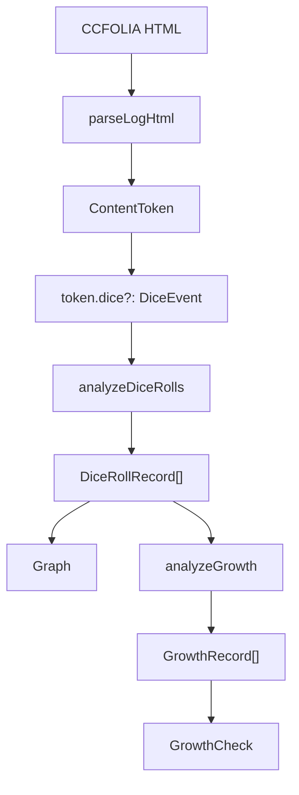

# Logmake Dice Analysis Spec

作成日: 2026-05-31

この文書は、`src/logmake` の次回改修で固定するダイス解析、グラフ集計、成長判定表示の仕様をまとめる。

主目的は、出目解析そのものと CoC 成長判定表示を分離し、`1d100`、`RESB`、`CBR`、`CBRB` などを同じ出目集計の土台で扱えるようにすること。

## 結論

- `DiceEvent` は、ログ本文 token から抽出した 1 判定分の解析結果として維持する。
- `DiceRollRecord` を新設し、グラフは `DiceRollRecord[]` だけを見る。
- `GrowthRecord` を新設し、成長チェックは `GrowthRecord[]` だけを見る。
- `GrowthRecord` は `roll: DiceRollRecord` を持ち、元の `DiceEvent` は `record.roll.dice` 経由で参照する。
- グラフは `DiceEvent.primaryRoll` を 1 回だけ数える。
- CoC7 のボーナス・ペナルティダイスは、候補値ではなく採用出目だけを数える。
- CBR / CBRB は、グラフでは 1 判定 1 出目として扱う。
- 技能不明の表示オプションは成長チェックだけに効かせ、グラフには影響させない。
- グラフのタブ表示切替は、出力 HTML のタブ表示切替とは別管理にする。

## データフロー



`Graph` は `GrowthAnalysis` を経由しない。グラフに入るかどうかは、成長判定対象かどうかではなく、`DiceRollRecord` として有効かどうかで決める。

## 型の方針

実装時の名前や詳細は調整してよいが、責務は次の形に寄せる。

```ts
interface DiceRollRecord {
  id: string
  entryId: string
  charName: string
  tabName: string
  value: number
  dice: DiceEvent
}

interface DiceEventTarget {
  name: string
  judge: string | null
  outcomeText?: string
  target?: number
}

type GrowthTargetKind =
  | 'known'
  | 'genericD100'
  | 'resistance'
  | 'combination'
  | 'freeText'

interface GrowthRecord {
  id: string
  roll: DiceRollRecord
  label: GrowthLabel
  targetNames: string[]
  initialSuccessTargetNames: string[]
  status: boolean
  targetKind: GrowthTargetKind
}
```

`GrowthRecord` 側に `charName`、`tabName`、`value`、`sourceDice` を重複して持たせない。出目としての事実は `DiceRollRecord` に寄せる。

`rollId` 参照だけにする案もあるが、現状のアプリでは永続化や差分同期をしていないため、`roll: DiceRollRecord` を直接持つ方が読みやすい。将来 ID ベースの正規化が必要になった場合に `rollId` へ移す。

`DiceRollRecord.id` と `GrowthRecord.id` は決定論的に生成する。基本形は `entryId` と token / roll の連番から作る。UUID や乱数は、テストや差分確認を不安定にするため使わない。

## 技能名の正規化

ログ上の技能名は、初期値 JSON と比較する前に system 別の正規化を通す。

正規化の責務:

- 前後空白を除去する。
- `【】` だけで囲まれた技能名は中身を使う。
- カンマ区切りの複合判定では、各パーツを個別に正規化する。
- system adapter が持つ明示的な alias だけを正規名へ寄せる。
- alias にない名前は、推測変換せず trim 後の文字列をそのまま使う。

CoC6 の既知 alias:

| ログ上の表記 | 正規名 |
| --- | --- |
| `こぶし` | `こぶし（パンチ）` |
| `パンチ` | `こぶし（パンチ）` |
| `こぶしパンチ` | `こぶし（パンチ）` |
| `こぶし（パンチ）` | `こぶし（パンチ）` |
| `MA` / `ma` | `マーシャルアーツ` |
| `マーシャルアーツ` | `マーシャルアーツ` |

前方一致、部分一致、かな漢字の推測変換はしない。たとえば `こぶし攻撃` を `こぶし（パンチ）` には寄せない。

初期値成功判定では、正規化後の target 名と初期値 JSON のキーを比較する。

## DiceRollRecord の生成仕様

`DiceRollRecord` は、次の条件を満たす `DiceEvent` から生成する。

- `primaryRoll` が 1 から 100 の数値である。
- ログ上の 1 判定に対応している。
- 技能名や target が取れなくてもよい。

`rolls` に複数候補値が入る場合でも、グラフ集計では `primaryRoll` だけを使う。

### 例: 通常技能判定

```txt
CCB<=50 【目星】 (1D100<=50) ＞ 42 ＞ 成功
```

- `DiceEvent.primaryRoll`: `42`
- `DiceRollRecord.value`: `42`
- グラフ: 1 回だけ数える。
- 成長チェック: `目星` の成長候補として扱う。

### 例: 汎用 d100

```txt
1d100<=50 (1D100<=50) ＞ 89 ＞ 失敗
```

- `DiceEvent.primaryRoll`: `89`
- `DiceEvent.targets`: `[]`
- `DiceRollRecord.value`: `89`
- グラフ: 1 回だけ数える。
- 成長チェック: `genericD100` の技能不明候補。表示するかは成長チェックの技能不明オプションに従う。

### 例: 技能名付き d100

```txt
1d100<=50 【正気度ロール】 (1D100<=50) ＞ 89 ＞ 失敗
```

- `DiceEvent.primaryRoll`: `89`
- `DiceEvent.targets`: `[{ name: '正気度ロール', target: 50 }]`
- `DiceEvent.status`: `true`
- `GrowthRecord.targetKind`: `known`
- グラフ: 1 回だけ数える。
- 成長チェック: `正気度ロール` の判定として扱う。

`1d100<=50` は、技能名が取れない場合は汎用 d100 として扱い、技能名が取れる場合は `CCB` などの D100 判定と同様に扱う。

`targetKind: 'known'` は「初期値 JSON に存在する」という意味ではない。ログから判定対象名と目標値を構造的に取れた、という意味で使う。初期値 JSON に存在するかどうかは、初期値成功判定だけで見る。

実装では、ログ由来の `&lt;=` とテスト文字列などの `<=` の両方を許容する。

### 例: RESB

```txt
RESB(12-10) ＞ 35 ＞ 成功
```

- `DiceEvent.primaryRoll`: `35`
- `DiceEvent.targets`: `[]`
- `DiceRollRecord.value`: `35`
- グラフ: 1 回だけ数える。
- 成長チェック: 技能名がないため、通常は表示しない。技能不明表示を ON にした場合の扱いは `resistance` として区別できるようにする。

### 例: CBR

```txt
CBR(50,40) ＞ 73[失敗,失敗] ＞ 失敗
```

- `DiceEvent.primaryRoll`: `73`
- `DiceEvent.targets`: `[]`
- `DiceRollRecord.value`: `73`
- グラフ: 1 回だけ数える。
- 成長チェック: 技能名がないため、通常は表示しない。技能不明表示を ON にした場合は `targetKind: 'combination'` として、`freeText` とは区別して扱う。

### 例: CoC7 ボーナス・ペナルティダイス

```txt
CC+3<=70e 【目星】 (1D100<=14) ボーナス・ペナルティダイス[3] ＞ 63, 73, 33, 13 ＞ 13 ＞ 成功
```

- 候補値: `63, 73, 33, 13`
- 採用出目: `13`
- `DiceEvent.primaryRoll`: `13`
- `DiceRollRecord.value`: `13`
- グラフ: `13` を 1 回だけ数える。候補値は数えない。
- 成長チェック: CoC7 の suffix `e` を見て、必要に応じて `イクストリーム` として分類する。

## GrowthRecord の生成仕様

成長チェックは、`DiceRollRecord` を入力として `GrowthRecord` を作る。`DiceEvent.targets` を target ごとに `GrowthRecord` へ分解しない。

CBR / CBRB のような複合判定も、成長チェック上は 1 行として扱う。

## 成長ラベル優先順位

成長ラベルは次の順に判定する。

1. クリティカル
2. スペシャル / イクストリーム / ハード
3. ファンブル
4. 故障
5. 初期値成功
6. 通常成功
7. 通常失敗

初期値成功は、上位ラベルに該当しない成功判定でのみ使う。たとえば初期値と一致する技能でスペシャルが出た場合は、`初期値成功` ではなく `スペシャル` とする。

`ファンブル＆故障` のように複数の結果語を含む場合は、既存と同じく `ファンブル` を優先する。

## 初期値成功の判定

初期値成功は、次の条件を満たす target だけを対象にする。

- target 名が初期値 JSON の技能名と対応する。
- target の目標値が初期値 JSON の値と一致する。
- その target 自身が成功している。

CBR / CBRB のように target ごとの結果がある場合は、`target.outcomeText` を見る。全体結果だけで初期値成功 target を決めない。

`target.outcomeText` がない複合判定では、target ごとの成功可否を安全に判断できない。その場合はクラッシュさせず、`initialSuccessTargetNames` には入れない。単一 target の判定で `target.outcomeText` がない場合だけ、`dice.outcomeText` を fallback として使ってよい。

### 例: CBRB の全成功

```txt
CBRB(50,25) こぶし,組み付き ＞ 20[成功,成功] ＞ 成功
```

初期値:

- `こぶし（パンチ）`: `50`
- `組み付き`: `25`

扱い:

- `DiceRollRecord.value`: `20`
- `こぶし` は `こぶし（パンチ）` に正規化する。
- `GrowthRecord.targetNames`: `['こぶし（パンチ）', '組み付き']`
- `GrowthRecord.initialSuccessTargetNames`: `['こぶし（パンチ）', '組み付き']`
- `GrowthRecord.label`: `初期値成功`
- 成長チェック表示: 1 行で表示する。

表示例:

```txt
初期値成功 | こぶし（パンチ）, 組み付き | 出目 20 | 成功
```

### 例: CBRB の部分成功

```txt
CBRB(50,25) こぶし,組み付き ＞ 30[成功,失敗] ＞ 部分的成功
```

初期値:

- `こぶし（パンチ）`: `50`
- `組み付き`: `25`

扱い:

- `DiceRollRecord.value`: `30`
- `こぶし` は `こぶし（パンチ）` に正規化する。
- `こぶし（パンチ）`: 成功、かつ初期値成功。
- `組み付き`: 失敗。初期値成功ではない。
- `GrowthRecord.targetNames`: `['こぶし（パンチ）', '組み付き']`
- `GrowthRecord.initialSuccessTargetNames`: `['こぶし（パンチ）']`
- `GrowthRecord.label`: `初期値成功`
- 成長チェック表示: 1 行で表示する。

表示例:

```txt
初期値成功 | こぶし（パンチ）, 組み付き | 出目 30 | 部分的成功
```

UI の一覧では 1 行表示を優先する。必要になったら、詳細表示やツールチップで `初期値成功対象: こぶし（パンチ）` を見せる。内部データには `initialSuccessTargetNames` を保持し、人間が確認できる余地を残す。

### 例: CBRB で失敗 target だけが初期値

```txt
CBRB(60,25) 図書館,組み付き ＞ 30[成功,失敗] ＞ 部分的成功
```

初期値:

- `図書館`: `25`
- `組み付き`: `25`

扱い:

- `図書館`: 成功しているが、目標値 `60` は初期値ではない。
- `組み付き`: 初期値 `25` と一致するが、失敗している。
- `GrowthRecord.initialSuccessTargetNames`: `[]`
- `GrowthRecord.label`: `通常成功`

「どれか 1 つでも初期値」ではなく、「成功した target の中に初期値 target がある」場合だけ `初期値成功` にする。

### 例: CBRB の自由記述 target

```txt
CBRB(80,85) 【攻撃】対象：XX ＞ 40[成功,成功] ＞ 成功
```

- `DiceRollRecord.value`: `40`
- グラフ: 1 回だけ数える。
- `GrowthRecord.targetNames`: `['【攻撃】対象：XX']`
- `GrowthRecord.initialSuccessTargetNames`: `[]`
- `GrowthRecord.targetKind`: `freeText`
- 初期値成功判定には使わない。

技能不明表示が OFF の場合は成長チェックに出さない。ON の場合は、自由記述 target として表示する。

## 技能不明表示オプション

技能不明表示オプションは、成長チェックだけに効く。

- OFF: `genericD100`、`resistance`、`combination`、`freeText` を非表示にする。
- ON: 上記も成長チェックに表示する。

グラフはこのオプションに影響されない。技能不明でも `DiceRollRecord` として有効ならグラフに含める。

`unknownSkill: boolean` だけでは情報が足りないため、`targetKind` のような分類を持たせる。

## グラフのタブ表示切替

グラフのタブ表示切替は、出力 HTML のタブ表示設定とは分ける。

- 出力 HTML 用: `TabConfig.visible`
- グラフ用: `graphVisibleTabs` または `AnalysisViewFilters` などの別 state

例:

- `雑談` タブを出力 HTML には含める。
- ただし `雑談` タブのダイスはグラフから除外する。

この 2 つは同時に成立できるようにする。

## 先に固定するテストケース

実装前に、次のケースをテストで固定する。

- `1d100<=50 (1D100<=50) ＞ 89 ＞ 失敗` が `DiceEvent` になる。
- `1d100<=50 【正気度ロール】 (1D100<=50) ＞ 89 ＞ 失敗` が target 付き `DiceEvent` になり、`status: true`、`targetKind: 'known'` になる。
- `RESB(12-10) ＞ 35 ＞ 成功` が `DiceRollRecord` になり、グラフに入る。
- `CBR(50,40) ＞ 73[失敗,失敗] ＞ 失敗` が `DiceRollRecord` になり、グラフに入る。
- `CBR(50,40) ＞ 73[失敗,失敗] ＞ 失敗` を成長チェックへ出す場合、`targetKind: 'combination'` になり、`freeText` にはならない。
- `CBRB(50,25) こぶし,組み付き ＞ 20[成功,成功] ＞ 成功` がグラフでは 1 回だけ数えられる。
- `CBRB(50,25) こぶし,組み付き ＞ 20[成功,成功] ＞ 成功` の `こぶし` が `こぶし（パンチ）` に正規化され、初期値 JSON と一致する。
- `CBRB(50,25) こぶし,組み付き ＞ 30[成功,失敗] ＞ 部分的成功` は `initialSuccessTargetNames` が成功 target のみになる。
- 複合判定で `target.outcomeText` がない場合でもクラッシュせず、target ごとの成功が判断できないものは `initialSuccessTargetNames` に入れない。
- 初期値かつスペシャル / ハード / イクストリームの場合は、`初期値成功` より上位ラベルを優先する。
- 技能不明表示 OFF は成長チェックだけに効き、グラフには影響しない。
- グラフのタブ非表示は、出力 HTML のタブ表示に影響しない。

## 実装順

1. `DiceRollRecord` と `analyzeDiceRolls()` を追加する。
2. `Graph` を `GrowthAnalysis` から切り離し、`DiceRollRecord[]` を見るようにする。
3. `1d100`、`RESB`、`CBR`、`CBRB` の `DiceEvent` 抽出テストを追加する。
4. parser を拡張する。
5. `GrowthRecord` を追加し、成長チェックを event 単位の表示へ変更する。
6. 初期値成功の優先順位と `initialSuccessTargetNames` をテストで固定する。
7. 技能不明表示オプションを成長チェックに追加する。
8. グラフ用タブ表示切替を追加する。

## Claude CLI レビュー状況

この仕様について `claude -p` で追加レビューを依頼しようとしたが、ローカル CLI が未ログインだった。

```txt
Not logged in · Please run /login
```

そのため、この文書には Claude CLI からの追加レビュー結果は反映していない。
