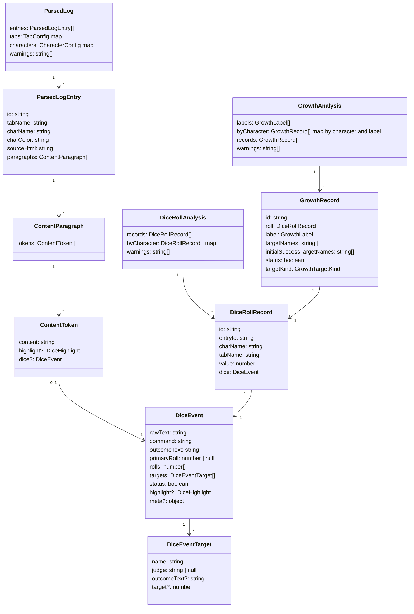
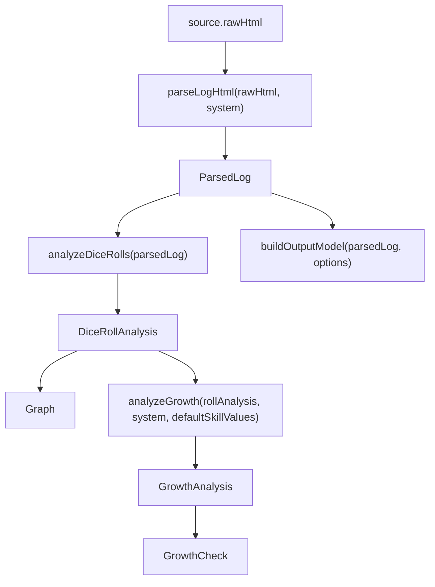

# Logmake Dice Implementation Plan

作成日: 2026-05-31

この文書は、`docs/logmake-dice-analysis-spec.md` を実装するための作業計画である。仕様判断は spec を正とし、この文書は「どのファイルをどう変えるか」を固定する。

## ゴール

- グラフを `GrowthAnalysis.records` 依存から切り離し、`DiceRollRecord[]` で集計する。
- 成長チェックを target 単位の `DiceRecord` から、roll 単位の `GrowthRecord` へ移行する。
- `1d100`、`RESB`、`CBR`、`CBRB` を出目解析の土台で扱う。
- CBR / CBRB はグラフでは 1 判定 1 回、成長チェックでは 1 行表示にする。
- 初期値成功は、成功した target の中に初期値 target がある場合だけ付与する。

## 非ゴール

- 出力 HTML の本文生成仕様は変更しない。
- 出力 HTML のタブ表示設定 `TabConfig.visible` と、グラフ用タブ表示設定を混ぜない。
- CoC 以外の system 追加はしない。
- CoC7 の候補出目を全件集計する機能は作らない。採用出目 `primaryRoll` だけを数える。

## オブジェクト図



依存方向:

- `DiceEvent` は parse 結果の事実。
- `DiceRollRecord` はグラフと成長判定が共有する出目レコード。
- `GrowthRecord` は成長チェック表示用の派生レコード。
- `GrowthRecord` は `DiceEvent` を直接持たず、`roll.dice` 経由で参照する。

## データフロー



`buildOutputModel()` と `buildOutputHtml()` は `ParsedLog` を使い続ける。出目解析や成長判定の変更を出力 HTML に波及させない。

## 変更対象ファイル

### 型定義

- `src/logmake/types/index.ts`
  - `DiceRollRecord`
  - `DiceRollAnalysis`
  - `GrowthTargetKind`
  - `GrowthRecord`
  - `GrowthAnalysis` の `DiceRecord` 依存を `GrowthRecord` 依存へ変更
  - 旧 `DiceRecord` は使い切ったら削除する。暫定 alias は増やさない。

### 解析ロジック

- `src/logmake/lib/analyzeDiceRolls.ts`
  - 新規追加。
  - `ParsedLog` から `DiceRollAnalysis` を作る。
- `src/logmake/lib/analyzeGrowth.ts`
  - 入力を `ParsedLog` から `DiceRollAnalysis` へ変更する。
  - target ごとの record 生成をやめ、roll ごとに最大 1 件の `GrowthRecord` を生成する。
- `src/logmake/systems/types.ts`
  - `GrowthCapability.classifyRecord()` を event / roll 単位 API に変更する。
- `src/logmake/systems/coc/cocGrowth.ts`
  - CoC 用 `GrowthRecord` 分類ロジックへ変更する。
- `src/logmake/systems/coc/cocDiceExtractor.ts`
  - `1d100` 形式を検出する。
  - `<=` と `&lt;=` の両方を許容する。
  - CBR / CBRB の `target.outcomeText` を維持する。
- `src/logmake/systems/coc/shared.ts`
  - 技能名正規化や outcome 判定など、CoC 共通 helper だけを置く。

### UI と hook

- `src/logmake/hooks/useLogmakePageState.ts`
  - `diceRollAnalysis = analyzeDiceRolls(parsedLog)` を追加。
  - `analysis = analyzeGrowth(diceRollAnalysis, selectedSystem, defaultSkillValues.data)` に変更。
  - `derived` に `diceRollAnalysis` を追加する。
- `src/logmake/components/features/Graph.tsx`
  - props を `analysis: GrowthAnalysis | null` から `rollAnalysis: DiceRollAnalysis | null` へ変更。
  - グラフ用タブ表示 state を追加する。
  - `graphBuckets()` へ渡す records は、グラフ用タブ表示で filter する。
- `src/logmake/components/features/GrowthCheck.tsx`
  - `GrowthRecord` 仕様に合わせて `record.roll.charName`、`record.roll.tabName`、`record.roll.value` を参照する。
  - 技能不明表示オプションを追加する。
- `src/logmake/lib/buildGrowthSummaryText.ts`
  - `GrowthRecord` の形に合わせる。
  - `targetNames.join(', ')` を表示名として使う。
  - `filters.visibility.unknownSkill` が false の場合、`targetKind !== 'known'` を除外する。
- `src/logmake/lib/defaults.ts`
  - `GrowthFilters` に技能不明表示オプションを追加する。

### テスト

- `src/logmake/test/analyzeDiceRolls.test.ts`
  - 新規追加。
- `src/logmake/test/analyzeGrowth.test.ts`
  - `GrowthRecord` 仕様へ更新。
- `src/logmake/test/parseLogHtml.test.ts`
  - `1d100` と CBRB outcome の parse ケースを追加。
- `src/logmake/test/GrowthCheck.test.tsx`
  - 技能不明表示オプションを追加。
- `src/logmake/test/buildGrowthSummaryText.test.ts`
  - `GrowthRecord` 表示へ更新。
- `src/logmake/test` 配下の visual / output tests
  - 出力 HTML 仕様に影響がないことを確認する。期待値更新が必要なら理由を確認する。

## 実装手順

### 1. 型を追加する

`src/logmake/types/index.ts` に次を追加する。

```ts
export interface DiceRollRecord {
  id: string
  entryId: string
  charName: string
  tabName: string
  value: number
  dice: DiceEvent
}

export interface DiceRollAnalysis {
  records: DiceRollRecord[]
  byCharacter: Record<string, DiceRollRecord[]>
  warnings: string[]
}

export type GrowthTargetKind =
  | 'known'
  | 'genericD100'
  | 'resistance'
  | 'combination'
  | 'freeText'

export interface GrowthRecord {
  id: string
  roll: DiceRollRecord
  label: GrowthLabel
  targetNames: string[]
  initialSuccessTargetNames: string[]
  status: boolean
  targetKind: GrowthTargetKind
}
```

`GrowthAnalysis` は次へ変更する。

```ts
export interface GrowthAnalysis {
  labels: GrowthLabel[]
  byCharacter: Record<string, Partial<Record<GrowthLabel, GrowthRecord[]>>>
  records: GrowthRecord[]
  warnings: string[]
}
```

ID は決定論的に作る。基本は `entry.id` + paragraph index + token index。

例:

```ts
const id = `${entry.id}-dice-${paragraphIndex}-${tokenIndex}`
```

`GrowthRecord.id` は `roll.id` から作る。

```ts
const id = `${roll.id}-growth`
```

### 2. `analyzeDiceRolls()` を追加する

追加ファイル: `src/logmake/lib/analyzeDiceRolls.ts`

責務:

- `ParsedLog.entries[].paragraphs[].tokens[]` を走査する。
- `token.dice?.primaryRoll` が 1 から 100 の数値なら `DiceRollRecord` を作る。
- `targets.length === 0` でも除外しない。
- `byCharacter` は graph dataset 作成を簡単にするために持つ。
- `warnings` は `parsedLog.warnings` を引き継ぐ。

疑似コード:

```ts
export function analyzeDiceRolls(parsedLog: ParsedLog): DiceRollAnalysis {
  const records: DiceRollRecord[] = []
  const byCharacter: Record<string, DiceRollRecord[]> = {}

  parsedLog.entries.forEach((entry) => {
    entry.paragraphs.forEach((paragraph, paragraphIndex) => {
      paragraph.tokens.forEach((token, tokenIndex) => {
        const dice = token.dice
        if (!dice || !isValidPrimaryRoll(dice.primaryRoll)) return

        const record = {
          id: `${entry.id}-dice-${paragraphIndex}-${tokenIndex}`,
          entryId: entry.id,
          charName: entry.charName,
          tabName: entry.tabName,
          value: dice.primaryRoll,
          dice,
        }

        records.push(record)
        ;(byCharacter[record.charName] ??= []).push(record)
      })
    })
  })

  return { records, byCharacter, warnings: [...parsedLog.warnings] }
}
```

`isValidPrimaryRoll()` は `Number.isInteger(value) && value >= 1 && value <= 100`。

### 3. Graph を `DiceRollAnalysis` へ移行する

`src/logmake/components/features/Graph.tsx` の props を変更する。

```ts
interface GraphProps {
  rollAnalysis: DiceRollAnalysis | null
  characters: Record<string, CharacterConfig>
}
```

dataset 作成は `rollAnalysis.byCharacter` を使う。

グラフ用タブ表示 state は `Graph` 内部に閉じる。

```ts
const [visibleTabs, setVisibleTabs] = useState<Record<string, boolean>>({})
```

ただし `Graph` がタブ一覧を知らないと UI を作れないため、props に `tabs` を足す。

```ts
interface GraphProps {
  rollAnalysis: DiceRollAnalysis | null
  characters: Record<string, CharacterConfig>
  tabs: Record<string, TabConfig>
}
```

`TabConfig.visible` は使わない。graph 用 checkbox の初期値は常に true。

### 4. `useLogmakePageState()` の派生値を分ける

`parsedLog` から `diceRollAnalysis` を作る。

```ts
const diceRollAnalysis = useMemo(() => {
  if (!parsedLog) return null
  return analyzeDiceRolls(parsedLog)
}, [parsedLog])
```

`analysis` は `diceRollAnalysis` を入力にする。

```ts
const analysis = useMemo(() => {
  if (!diceRollAnalysis) return null
  return analyzeGrowth(diceRollAnalysis, selectedSystem, defaultSkillValues.data)
}, [defaultSkillValues.data, diceRollAnalysis, selectedSystem])
```

`derived` に `diceRollAnalysis` を追加し、`App.tsx` から `Graph` へ渡す。

### 5. `1d100` parse を追加する

対象: `src/logmake/systems/coc/cocDiceExtractor.ts`

要求:

- `1d100<=50 (1D100<=50) ＞ 89 ＞ 失敗`
- `1d100<=50 【正気度ロール】 (1D100<=50) ＞ 89 ＞ 失敗`
- `<=` と `&lt;=` の両方を許容する。

実装方針:

- 既存の `createD100ResultRegex(commandPrefix)` に無理やり混ぜるより、`createGenericD100ResultRegex()` を別に作る。
- `parseDiceResult()` は `d100ResultRegex`、`genericD100ResultRegex`、`commandResultRegex` の順に試す。
- `ParsedCocDiceResult` に `kind` を追加する。`command` 文字列だけを分岐根拠にしない。

例:

```ts
type ParsedCocDiceKind = 'systemCommand' | 'genericD100'
```

`1d100<=50 【正気度ロール】` は tail から target を作る。target 値は command 内の `<=50` から取る。

`1d100<=50` で tail が空なら `targets: []`。

### 6. target kind を判定する

`GrowthRecord.targetKind` の判定規則:

- `targets.length > 0` かつ構造的に target 名と目標値が取れた: `known`
- generic `1d100` で `targets.length === 0`: `genericD100`
- `RES` / `RESB`: `resistance`
- `CBR` / `CBRB` で `targets.length === 0`: `combination`
- fallback target など、tail をそのまま表示名にしたもの: `freeText`

現状の `DiceEventTarget` だけでは fallback target と known target の区別が曖昧なので、次の方針を採用する。

- `DiceEvent.meta.targetKind?: GrowthTargetKind` は追加しない。
- `DiceEventTarget.judge === null` を fallback 判定の主材料にする。
- command 種別は `dice.command` から読む。

判定 helper は `cocGrowth.ts` に置く。parser ではなく成長チェック表示の分類に閉じるため、`cocDiceExtractor.ts` には置かない。

```ts
function classifyTargetKind(dice: DiceEvent): GrowthTargetKind {
  if (/^1d100/i.test(dice.command) && dice.targets.length === 0) return 'genericD100'
  if (/^RESB?\(/i.test(dice.command)) return 'resistance'
  if (/^CBRB?\(/i.test(dice.command) && dice.targets.length === 0) return 'combination'
  if (dice.targets.some((target) => target.judge === null)) return 'freeText'
  return 'known'
}
```

`1d100<=50 【正気度ロール】` は `known`。初期値 JSON に存在するかどうかは `targetKind` には影響させない。

### 7. GrowthCapability を roll 単位に変更する

`src/logmake/systems/types.ts` を変更する。

採用形:

```ts
export interface ClassifyGrowthEventOptions {
  defaultSkillValues: DefaultSkillValueMap
  roll: DiceRollRecord
}

export interface GrowthClassification {
  label: GrowthLabel
  targetNames: string[]
  initialSuccessTargetNames: string[]
  status: boolean
  targetKind: GrowthTargetKind
}

export interface GrowthCapability {
  labels: GrowthLabel[]
  loadDefaultSkillValues(): Promise<DefaultSkillValueMap>
  classifyEvent(options: ClassifyGrowthEventOptions): GrowthClassification | null
}
```

`isGrowthTarget()` は `classifyEvent()` に統合する。成長対象外なら `null` を返す。

理由:

- `isGrowthTarget(dice)` と `classifyEvent()` を分けると、target kind や技能不明表示の判断が二重化する。
- roll 単位の API にすれば、CBRB を 1 行扱いにできる。

### 8. CoC growth 分類を変更する

`src/logmake/systems/coc/cocGrowth.ts`

分類の順序:

1. critical
2. refined success: special / hard / extreme
3. fumble
4. malfunction
5. initial success
6. normal success
7. normal failure

注意:

- `ファンブル＆故障` は `ファンブル` を優先する。
- `初期値成功` は上位成功ラベルの後。
- `initialSuccessTargetNames` は「成功した target」だけから作る。

success 判定 helper:

```ts
function isTargetSuccess(dice: DiceEvent, target: DiceEventTarget): boolean {
  const outcome = target.outcomeText ?? (dice.targets.length === 1 ? dice.outcomeText : '')
  return /クリティカル|決定的成功|スペシャル|イクストリーム成功|ハード成功|成功/.test(outcome)
}
```

複合判定で `target.outcomeText` がない場合は、target ごとの成功が判断できないため false にする。

```ts
function isInitialSuccessTarget(
  dice: DiceEvent,
  target: DiceEventTarget,
  defaultSkillValues: DefaultSkillValueMap
): boolean {
  return (
    isTargetSuccess(dice, target) &&
    target.target !== undefined &&
    defaultSkillValues[target.name] === target.target
  )
}
```

target names:

- `targets.length > 0`: `targets.map((target) => target.name)`
- `targets.length === 0` かつ技能不明表示対象: `[dice.command]` を表示名にする。

### 9. `analyzeGrowth()` を `GrowthRecord` 生成に変更する

入力:

```ts
analyzeGrowth(
  rollAnalysis: DiceRollAnalysis,
  system: LogmakeSystem,
  defaultSkillValues: DefaultSkillValueMap
): GrowthAnalysis
```

疑似コード:

```ts
for (const roll of rollAnalysis.records) {
  const classification = growth.classifyEvent({ defaultSkillValues, roll })
  if (!classification) continue

  const record: GrowthRecord = {
    id: `${roll.id}-growth`,
    roll,
    ...classification,
  }

  records.push(record)
  const charRecords = (byCharacter[roll.charName] ??= {})
  ;(charRecords[record.label] ??= []).push(record)
}
```

warnings は `rollAnalysis.warnings` を引き継ぐ。

### 10. GrowthCheck と summary を更新する

`GrowthCheck` のタブ filter は成長チェック専用として維持する。

`GrowthFilters.visibility` に `unknownSkill` を追加する。

```ts
visibility: {
  tabName: boolean
  value: boolean
  status: boolean
  unknownSkill: boolean
}
```

`createGrowthFilters()` の初期値は `unknownSkill: false` とする。既存 UI の「オプション」欄へ `技能不明` checkbox を追加する。

summary 表示:

```ts
const targetText = record.targetNames.join(', ') || record.roll.dice.command
const parts = [
  filters.visibility.tabName ? `[${record.roll.tabName}]` : '',
  targetText,
  filters.visibility.value ? `＞ ${record.roll.value}` : '',
]
```

技能不明非表示:

```ts
if (!filters.visibility.unknownSkill && record.targetKind !== 'known') {
  return false
}
```

`status` filter:

```ts
filters.visibility.status || !record.status
```

### 11. テストを先に更新する

テストファーストで、まず失敗するテストを追加する。

#### `parseLogHtml.test.ts`

- `1d100<=50 (1D100<=50) ＞ 89 ＞ 失敗`
  - `dice.command` が `1d100<=50` 相当。
  - `primaryRoll: 89`
  - `targets: []`
- `1d100<=50 【正気度ロール】 (1D100<=50) ＞ 89 ＞ 失敗`
  - `targets: [{ name: '正気度ロール', target: 50 }]`
  - `status: true`
- `CBRB(50,25) こぶし,組み付き ＞ 30[成功,失敗] ＞ 部分的成功`
  - targets に `outcomeText: '成功'` / `outcomeText: '失敗'` が入る。

#### `analyzeDiceRolls.test.ts`

- `RESB(12-10)` が records に入る。
- `CBR(50,40)` が records に入る。
- `CBRB(50,25)` が graph 用 records では 1 件だけになる。
- CoC7 bonus / penalty は `primaryRoll` だけが `value` になる。

#### `analyzeGrowth.test.ts`

- `CBRB(50,25) こぶし,組み付き ＞ 20[成功,成功]`
  - `targetNames: ['こぶし（パンチ）', '組み付き']`
  - `initialSuccessTargetNames: ['こぶし（パンチ）', '組み付き']`
- `CBRB(50,25) こぶし,組み付き ＞ 30[成功,失敗]`
  - `initialSuccessTargetNames: ['こぶし（パンチ）']`
- `CBRB(60,25) 図書館,組み付き ＞ 30[成功,失敗]`
  - `initialSuccessTargetNames: []`
  - `label: '通常成功'`
- 初期値かつスペシャル / ハード / イクストリームは `初期値成功` より上位ラベル。
- `1d100<=50 【正気度ロール】` は `targetKind: 'known'`。
- `CBR(50,40)` を表示対象にする場合は `targetKind: 'combination'`。
- `target.outcomeText` がない複合判定でもクラッシュしない。

#### `buildGrowthSummaryText.test.ts`

- `GrowthRecord.roll` から tab / value を表示する。
- `targetNames` を `, ` で連結して表示する。
- 技能不明 OFF では `genericD100` / `resistance` / `combination` / `freeText` を除外する。
- 技能不明 ON では表示する。

#### `Graph` 関連

- `Graph` が `DiceRollAnalysis` を受け取る。
- graph tab filter が off のタブだけ除外する。
- graph tab filter は `TabConfig.visible` を変更しない。

### 12. 検証コマンド

最小:

```bash
pnpm test:unit
pnpm lint
pnpm build
```

UI や graph 表示まで触った後:

```bash
pnpm test:e2e
```

最後に:

```bash
git diff --check
```

## 実装時の注意点

- `Graph` が `GrowthAnalysis` を import していたら移行漏れ。
- `graphBuckets()` は `DiceRollRecord[]` を受けてもよいが、名前を変えるなら影響範囲を小さくする。
- `DiceEvent.rolls` は今回は設計変更しない。候補値を保持する改善は別タスク。
- `targetKind` は成長チェック表示用の分類であり、グラフ集計には使わない。
- 技能名正規化は明示 alias だけに限定する。推測変換を追加しない。
- `DiceRecord` を残す場合は一時的な移行だけにする。最終形では `GrowthRecord` へ寄せる。
- docs と実装が食い違ったら、`docs/logmake-dice-analysis-spec.md` を先に更新してから実装を合わせる。
